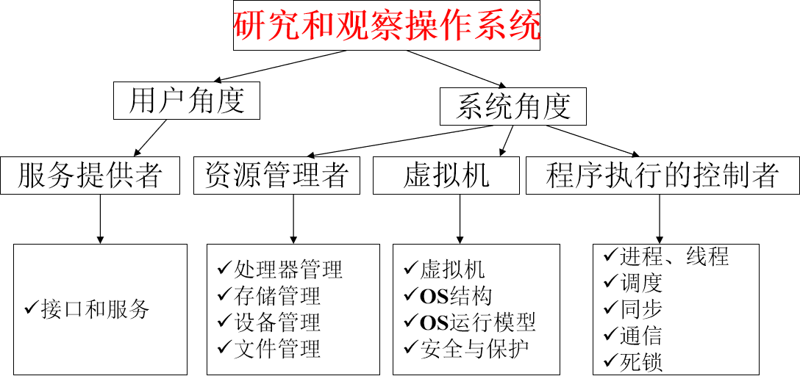

# 课程简介

## 教学目的

1. 学习操作系统的基本原理与设计方法 ，培养并发程序的设计与系统软件开发的理论基础。
2. 通过理论与实验教学，培养理论与实践结合的能力，重点培养分析解决计算机复杂工程问题的能力和设计能力。
3. 通过Linux实例，加深对系统中抽象概念和基本原理的理解，掌握操作系统的分析、设计开发方法。

## 教学内容与学时安排

1. 总学时：48=40（讲课）+8（实验）
2. 操作系统概论 （3 学时）
3. 操作系统用户接口 （3 学时）
4. 进程管理 （8学时+8学时实验）
5. 处理机调度 （6 学时）
6. 存储管理 （8学时）
7. 文件系统 （6 学时）
8. 设备管理 （6 学时）

## 课程考核

1. 课程类别：技术基础课（必修）
2. 考核方式：闭卷、笔试
3. 成绩组成: 试卷成绩(70%)+平时成绩(15%)+实验成绩(15%)

## 教学用书

**教材:**

张尧学，宋虹，张高.计算机操作系统教程（第4版）.北京：清华大学出版社，2014

**参考资料:**

[1] 汤子瀛主编．计算机操作系统（修订版）．西安：西安电子科技大学出版社，2001 ．

[2]张尧学编．计算机操作系统教程（第4版）习题解答与实验指导．北京：清华大学出版社，2014 ．

[3] Andrew S.Tanenbaum. 陈向群等译.现代操作系统（第二版） ．北京：机械工业出版社，2005 ．

[4]陈莉君等编.Linux操作系统原理与应用.北京：清华大学出版社，2006 ．

## 学习路线

>dark主题会看不清图中的箭头

## 学习答疑

**联系方式:**  [zhaojs@imut.edu.cn](mailto:zhaojs@imut.edu.cn)，1535068231@qq.com
