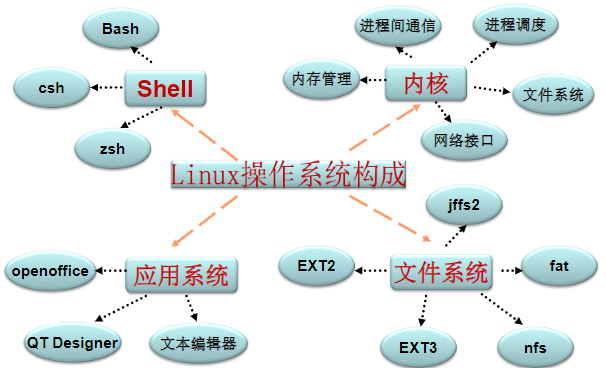
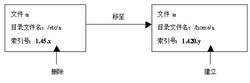

# 第2章 Linux入门及基础命令

1. 嵌入式Linux基础
2. Linux安装
3. Linux文件及文件系统
4. Linux基础命令
5. Vi编辑器

## 1. 嵌入式Linux基础

### Linux和GNU

- Linux是一套免费使用和自由传播的类UNIX操作系统 。该项目由芬兰的Linus Torvalds所启动。
- Linux是一个Unix兼容的系统，大部分通用的Unix工具和程序都可以在Linux系统下运行
- 使用GNU工具开发：
  - gcc，glibc，binutils，make等
- GNU = GNU is Not Unix
  - 由Richard Stallman在1984创建
  - 最初的软件：gcc、make、glibc...
  - GPL = General Public License 。通用公共许可证

### Linux优点

- 提供了先进的网络支持
- 多任务、多用户
- 符合IEEE POSIX标准
- 支持数十种文件系统格式
- 完全运行于保护模式
- 开放源代码
- 采用先进的内存管理机制，更加有效地利用物理内存

### Linux版本

- Linux版本分为两类
  - 内核（kernel）版本
    - 是指在Linux领导下的开发小组开发出来的系统内核版本号。
    - 目前最新内核版本号是 kernel **3.10**
- 发行（Distribution）版本
  - 以Linux kernel为核心，搭配各种应用程序和文档，包装起来，并提供安装界面和系统设置及管理工具，构成发行版本。

### Linux内核（Kernel）版本

- major.minor.patchlevel
- 主版本号.次版本号.当前内核版本的修订次数
- 次版本号是偶数，表示内核为稳定发布版本，是奇数，表示为不稳定的开发版本。

如： Kernel 2.6.18-19，表示对内核2.6版本的第18次修改，修改了19处。

### 发行（Distribution）版

- 套装软件版本
  - 如：Red Hat Linux 9.0的内核版本是2.4.20-8
  - Fedora Core 6的内核版本是kernel-2.6.18-1.2798
  - CentOS的内核版本是kernel-3.10.0-1160
- 有100多种Linux Distribution
- 目前主流的Linux Distribution
  - Red Hat Linux (Fedora Core)
  - CentOS
  - Debian Linux
  - Ubuntu Linux
  - 红旗 Linux
  - HarmonyOS

### Linux系统构成

### Linux作为嵌入式操作系统的优势

- 低成本开发系统
- 可应用于多种硬件平台 ：X86、PowerPC、ARM、XSCALE、MIPS、SH、68K、Alpha、SPARC等
- 可定制的内核
- 性能优异(内核精简，高效且稳定)
- 良好的网络支持

### 庞大的嵌入式Linux市场

### Linux学习网站

- [https://www.centos.org/](https://www.centos.org/)
- [https://ubuntu.com/](https://ubuntu.com/)
- [https://www.redhat.com/](enhttps://www.redhat.com/en)
- [https://unix.org/](https://unix.org/)
- [https://developer.harmonyos.com/cn/documentation/](https://developer.harmonyos.com/cn/documentation/)

## 2. Linux安装

>这部分内容不做整理,因为原始课件为redhat老版本的安装教程.
>而老师在实际教学过程中使用的是VMware下安装的CentOS.

### 作业：安装Linux操作系统

1. 可以安装为双系统
2. 可以在VmWare或virtual box虚拟机上安装Linux
3. 提交一份安装的报告

## 3. Linux文件及文件系统

### 文件类型

- 普通文件
- 目录文件
- 链接文件
- 设备文件 ：字符设备文件/块设备文件
- 管道
- 堆栈
- 套接字

### 目录文件与索引节点关系

- `mv  /etc/a  /home/a`

### 文件属性

- 第一个字符显示文件的类型：
  - “-”表示普通文件
  - “d”表示目录文件
  - “l”表示链接文件
  - “c”表示字符设备
  - “b”表示块设备
  - “p”表示命名管道比如FIFO文件（First In First Out，先进先出）
  - “f”表示堆栈文件比如LIFO文件（Last In First Out，后进先出）
  - “s”表示套接字
- 第一个字符之后有3个三位字符组：
  - 第一个三位字符组表示对于文件拥有者（u）对该文件的权限；
  - 第二个三位字符组表示文件用户组（g）对该文件的权限；
  - 第三个三位字符组表示系统其他用户（o）对该文件的权限；
  - 若该用户组对此没有权限，一般显示“-”字符

### 文件系统介绍

- ext2和ext3
- swap文件系统
- vfat文件系统
- NFS文件系统
- ISO9660文件系统
- 内存文件系统：proc、sys、ramdisk
- 嵌入式文件系统：ext2fs、jffs、yaffs等

### Linux目录结构

- /bin 该目录中存放Linux的常用命令
- /boot 该目录下存放的都是系统启动时要用到的程序
- /dev 该目录包含了Linux系统中使用的所有外部设备，它实际上是访问这些外部设备的端口，你可以访问这些外部设备，与访问一个文件或一个目录没有区别
- /sbin该目录用来存放系统管理员的系统管理程序
- /usr 用户应用程序和文件都存放在该目录下
- /etc该目录存放了系统管理时要用到的各种配置文件和子目录，例如网络配置文件、文件系统等。
- /home 用来存放该用户的主目录。
- /lib 该目录用来存放系统动态连接共享库，几乎所有的应用程序都会用到该目录下的共享库
- /tmp 用来存放不同程序执行产生的临时文件
- /lost+found 该目录在大多数情况下都是空的。但当突然停电、或者非正常关机后，有些文件就临时存放在这里。
- /mnt 该目录在一般情况下也是空的，你可以临时将别的文件系统挂在该目录下
- /proc 可以在该目录下获取系统信息，这些信是在内存中由系统自己产生的
- /root 超级用户的主目录
- /sys sys文件系统

## 4. Linux常用命令

### 登陆

- 进入linux系统，必须要输入用户的账号，在系统安装过程中，可以创建一下两种账号：
  - root—超级用户账号（系统管理员），使用这个账号可以在系统中做任何事情。
  - 普通用户—这个账号供普通用户使用，可以进行有限的操作。

一般的Linux使用者均为普通用户，而系统管理员一般使用超级用户完成一些系统管理的工作，如果只需要完成一些由普通账号就可以完成的任务，建议不使用超级用户。以免无意中破坏系统，影响系统正常运行。

- 用户登陆分为两步：
  - 第一步，输入用户的登录名
  - 第二步：输入用户的口令

    当用户正确的输入用户名和口令后，就能合法的进入系统，屏幕显示：

    `[root@localhost /root]#`

    超级用户可以对系统进行各种操作，超级用户提示符是“#”，其他用户提示符是”$”

### 控制台切换

- Liunx是一个多用户操作系统，它可以同时接受多个用户登陆。Linux还允许一个用户进行多次登陆，这是因为linux和unix一样，提供了虚拟控制台的访问方式，允许用还在同一时间从不同的虚拟控制台进行多次登陆。
- 虚拟控制台可以通过按下Ctrl+Alt+一个功能键F1~F7来实现。

### 4.1文件目录操作命令

- 查看目录ls
- 改变目录cd
- 查看目录pwd
- 创建删除目录mkdir,rmdir
- 文件的复制cp
- 文件的删除rm
- 文件的移动或更名mv
- 文件的显示cat、more
- ......

#### 改变工作目录

- cd

    格式：cd 目录名

    范例：

        `cd /home/`

        进入`/home`目录

#### 查看当前路径

- pwd

    格式：pwd

    范例：

        1、pwd

        显示当前工作目录的绝对路径

#### 创建、删除目录

- mkdir

    格式：mkdir [选项] 目录名

    范例：

        1、mkdir /home/workdir :
        在/home目录下创建workdir目录

        2、mkdir –p /home/dir1/dir2 :
        创建/home/dir1/dir2目录，如果dir1不存在，先创建dir1

- rmdir

    格式：rmdir 目录名
    范例：rmdir /home/workdir

#### 拷贝

- cp

    格式：cp [选项] 源文件或目录 目标文件目录

    范例：

        1、cp /home/test /tmp
        将/home目录下test文件copy到/tmp目录下

        2、cp –r /home/dir1 /tmp/
        将/home目录下的dir1目录copy到/tmp目录下

#### 删除

- rm

    格式：rm [选项] 文件或目录

    范例：

        1、rm /home/test
        删除/home目录下的test文件

        2、rm –r /home/dir
        删除/home目录下的dir1目录

#### 移动或更名

- mv

    格式：mv [选项] 源文件或目录 目标文件或目录

    范例：

        1、mv /home/test /home/test1
        将/home目录下的test文件更名为test1

        2、mv /home/dir1 /tmp/
        将/home目录下dir1目录移动到/tmp目录下

#### 文件显示

- cat :显示或链接一般的ascii文本文件

    格式：cat [选项]文件名

    范例：

        1、cat text：该命令显示text 这个文件的内容，cat -n file1.txt 显示 file1.txt 文件的内容同时显示行号

        2、cat file1 file2：该命令依顺序显示file1,file2 的内容

        3、cat file1 file2>file3：该命令把file1,file2 的内容结合起来再重定向>到file3 文件中

### 4.2 用户管理命令

- 添加用户useradd
- 删除用户userdel
- 修改密码passwd
- 用户切换su
- 文件的访问权限修改chmod
- 文件的拥有者和组修改chown

#### 添加、删除用户

- useradd

    格式：useradd [选项] 用户名

    范例：

        useradd smb
        添加名字为smb的用户

- userdel

    格式：userdel 用户名

    范例：

        userdel smb

#### 修改密码

- passwd

    格式：passwd [选项] 用户名

    范例：

        passwd smb
        修改用户smb的密码

#### 切换用户

- su

    格式：su [选项] [用户名]

    范例：

        su –root
        切换到root用户，并将root的环境变量同时带入

#### 访问权限

- 系统中每个文件和目录都有访问许可权限，用它来确定谁可以通过何种方式对文件和目录进行访问。
- 文件或目录的权限分为：只读、只写和可执行三种。
- 有三种不同类型的用户可对文件或目录进行访问：文件所有者、与所有者同组的用户、其他用户。所有者一般是文件的创建者。
- 每一个文件或目录的访问权限都有三组，每组用三位表示，分别为文件所有者的读写和执行权限，与所有者同组的用户的读写和执行的权限；其他用户的读写和执行的权限。通过ls –l列出文件详细信息时，最左边的是文件的访问权限。

- 如：ls –l sobsrc.tgz

    `-rw-r--r-- root root 483997 Ju1 15 17:31 sobsrc.tgz`

    注意：权限共10位，第1个字符指定文件类型，-表示普通文件，d表示目录。r代表读，w代表写，x代表可执行，-代表无该项权限。

#### 改变访问权限

- chmod

    格式：chmod [who] [+|-|=] [mode] 文件名

    参数：

    who：

        u 表示文件的拥有者

        g 表示文件所有者同组的用户

        o 表示其他用户

        a 表示所有用户

    [+|-|=]:

        + 表示添加某个权限

        - 表示取消某个权限

        =赋予给定权限

- mode：所表示的权限可使用数字组合实现

  - r：可读（4）
  - w：可写（2）
  - x：可执行（1）

    范例：

  1. `chmod g+w hello.c`
  2. `chmod 761 hello.c`

#### 文件的拥有者和组修改

- chown

    用于更改某个文件或目录的属主和属组

    格式：chown [用户:组] 文件

    范例：

        chown oracle:dba text

        该命令将 text 文件的属主和属组分别改为oracle 和dba

### 4.3 进程及任务管理

- 查看进程ps
- 查看cpu情况top
- 杀死进程kill

#### 查看进程

- ps

    格式：ps [选项]

    范例：

        1、ps –ef

        查看所有进程及其PID,系统时间，命令目录，执行者等

        2、ps -aux

        除了-ef显示的内容外，还可显示CPU及内存占用率，进程状态等

#### 动态查看cpu使用

- top

    格式：top

    范例：

        1、top

        查看系统中的进程对cpu、内存等的占用情况

#### 杀死进程

- kill

    格式：kill [选项] 进程号

    范例：

        1、kill –s SIGKILL 4096

        杀死4096号进程

        2、kill -9 PID，无条件杀死进程（TERM）

### 4.4 磁盘及目录管理

- 磁盘使用情况查看df
- 查看目录大小du
- 文件系统挂载mount、umount

#### 查看磁盘使用情况

- df

    格式：df [选项]

    范例：

        df –k

        以kB为单位显示磁盘使用情况

#### 查看目录大小

- du

    格式：du [选项] 目录

    范例：

        du –b ipc

        以字节为单位显示ipc这个目录的大小

#### 挂载

- mount

    格式：mount [选项] 设备源 目标目录

    范例：

        1、mount /dev/cdrom /mnt

        将光驱挂载到/mnt目录下
- umount

    格式：umount 目标目录

    范例：

        umount /mnt

        取消光驱在/mnt下的挂载

### 4.5 其他常用指令

- 文件打包tar
- 网络配置指令ifcongfig、netstat
- 软件安装指令rpm
- 文件查找find
- 帮助指令man

#### 打包与压缩

- tar

    格式：tar [选项] 目录或文件

    范例：

        1、tar cvf tmp.tar /home/tmp

        将/home/tmp目录下的所有文件和目录打包成一个tmp.tar文件

        2、tar xvf tmp.tar

        将tmp.tar在当前目录下解开

        3、tar cvzf tmp.tar.gz /home/tmp

        将/home/tmp目录下的所有文件和目录打包并压缩成一个tmp.tar.gz文件

        4、tar xvzf tmp.tar.gz

    将打包并压缩的文件tmp.tar.gz在当前目录下解开

#### 软件安装

- rpm

    格式：rpm [选项] [安装文件]

    范例：

        1、rpm –ivh tftp.rpm

        安装名字为tftp的文件

        2、rpm –qa

        列出已安装的rpm包

        3、rpm –e name

        卸载名字为name的rpm包

#### 网络配置

- ifconfig

    格式：ifconfig [选项] [网络接口]

    范例：

        1、ifconfig eth0 192.168.0.1

        配置eht0这一网卡的ip地址为192.168.0.1

        2、ifconfig eth0 down

        暂停eth0网卡的工作

        3、ifconfig eth0 up

        恢复eth0网卡的工作

#### 查看网络状态

- netstat

    格式：netstat [选项]

    范例：

        1、netstat -a

        查看系统中所有的网络监听端口

#### 查找文件

- find

    格式：find 路径 –name ‘文件名’

    范例：

        1、find ./ -name ‘test’

        在当前目录及其子目录查找名为test的文件

        2、find ./ -name ‘co*’

        在当前目录及其子目录查找名为co开头的文件

#### 查找字符串

- grep

    格式：grep [选项] 字符串

    范例：

        1、grep “file” ./ -r

        在当前目录及其子目录，查找包含file字符串的文件(-r表示该目录下的所有文件)

        2、netstat –a | grep tftp

        查看所有端口中用于tftp的端口

#### 帮助

- man

    格式：man 命令名

    范例：

        1、man grep

        查看grep命令的使用方法

## 5. Vi编辑器使用

### Vi编辑器

- Linux提供了一系列功能强大的编辑器，如vi和Emacs。vi 是linux系统的第一个全屏幕交互式编辑器，从诞生到现在一直得到广大用户青睐。
- vi有三种工作模式，分别为：**命令行模式、插入模式、底行模式**。

- 命令行模式：最初进入的一般模式，该模式下可以移动光标进行浏览，整行删除，但无法编辑文字。
- 插入模式：只有在该模式下，用户才能进行文字的编辑，用户可以使用`[ESC]`键返回到命令行模式。
- 底行模式：该模式下，光标位于屏幕底行，用户可以进行文件保存或退出操作，也可以设置编辑环境，如寻找字符串、列出行号等。

- vi hello.c
- 键入i进入插入模式
- 编辑
- 键入[ESC]到命令行模式
- 键入:wq保存退出

- 命令行模式常用功能键
  - yy：复制当前光标所在行
  - [n]yy：复制当前光标开始的n行
  - p：粘贴复制的内容到光标所在行
  - dd：删除当前光标所在行
  - [n]dd：删除当前光标所在行开始的n行
  - /name：查找光标之后的名为”name”的字符串
  - G：光标移动到文件尾（注意是大写）
  - u：取消前一个动作（注意是小写）

- 底行模式常用功能键：
  - :w 保存
  - :q 退出vi（系统会提示保存修改）
  - :q! 强行退出（对修改不做保存）
  - :wq 保存退出
  - :w [filename] 另存为filename文件
  - :set nu 显示行号
  - :set nonu 取消行号
