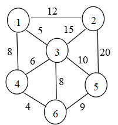

# 内蒙古工业大学2021—2022学年第二学期

## 《数据结构与算法》期末考试试卷(A)

(课程代码：020234011)

试卷审核人：  马 晓 波    考试时间： 2022.6.13

注意事项：

1. 本试卷适用于2020级计算机科学与技术、物联网专业学生使用。
2. 本试卷共6页，满分100分，答题时间100分钟。

## 一、问答题

（请写出下列问题的答案，本大题共7道小题，共43分）

1. 二维数组`A`，每个元素占3个字节，行下标`i`的范围从1到8，列下标j的范围从1到10，从首地址`SA`开始连续存放在存储器内。请回答下列问题：（4分）

    - （1）存放A至少需要多少个字节？
    - （2）若该数组按行序存放时，元素`A[8][5]`的起始地址是多少？

2. 对于如下图所示的图，按次序写出用普里姆（Prim）算法从顶点1开始求最小生成树产生的边；按次序写出用克鲁斯卡尔(Kruskal)算法从顶点1开始求最小生成树产生的边。（注：边用`（i，j）`的形式表示。）（10分）

    

    >dark主题会看不清,换成light主题就好了

3. 对于一个栈，如果入栈次序是A，B，C，写出全部可能的出栈序列。（5分）

4. 给定数据序列d={8,17,5,10,21,12,7,19,6,11}，请回答以下问题：（6分）
   - （1）试构造一棵二叉排序树。
   - （2）画出在此二叉排序树中删除17后的二叉排序树。

5. 给定一个关键字序列{49,38,65,97,76,13,27,50}，对该关键字序列作升序排序，请写出快速排序第一趟的结果；堆排序时所建的初始堆（小顶堆）。（5分）

6. 设二叉树采用顺序存储结构，如下图所示（第一行是位置值，第二行是结点值）：

    1|2|3|4|5|6|7|8|9|10|11|12|13|14|15|16|17|18|19|20
    -|-|-|-|-|-|-|-|-|--|--|--|--|--|--|--|--|--|--|--
    E|A|F| |D| |G| | | C| J|  |  | H| I|  |  |  |  | B

    请回答下列问题：（9分）

   - （1）画出二叉树型表示。
   - （2）写出此二叉树的先序遍历序列、中序遍历序列和后序遍历序列。  

7. 若串`S1="ABCDEFG"`，`S2="9898"`，`S3="##"`，`S4="012345"`，写出表达式：`concat(replace(S1,substr(S1,length(S2),length(S3)),S3),substr(S4,index(S2, '8'),length(S2)))`的结果（要求写出步骤）。（4分）

## 二、应用题

（请写出下列问题的答案，本大题共2道小题，共14分）

1. 欲用四种颜色对地图上的国家涂色，有相邻边界的国家不能用同一种颜色，请回答下列问题：（8分）
   - （1）采用何种数据结构表示地图上各国相邻的关系？
   - （2）涂色过程采用何种数据结构（栈/队列/树/图）？
   - （3）简述涂色过程。  

2. 田径赛的时间安排，设计比赛日程表，使得在尽可能短的时间内完成比赛。请回答下列问题：（6分）
   - （1）采用何种数据结构表示项目之间的关系（栈/队列/树/图）？
   - （2）怎样设计比赛日程表，简述该方法。

## 三、算法设计与分析题

（请写出下列问题的答案，本大题共5道小题，共43分）

1. 分析计算下述程序段的时间复杂度。(8分)

    （1）

    ```c
    i=s=0;
    while(s<0){  
        i++;
        s+=i; 
    }
    ```

    （2）

    ```c
    s=0
    for (j=1; j<=n; j++)
        for (i=1; i<=20; i++)
            s++;
    ```

2. 由二叉树的先序遍历序列和后序遍历序列是否可以唯一建立二叉树？若能，请说明理由；否则，给出反例。（5分）

3. 阅读算法（11分）

   - （1）请写出下列算法是哪种排序算法？并说明此排序算法结束的条件，以及最好和最坏是什么情况？

    ```c
    void sort(JD r[],int n)
    {  int m,i,j,flag=1;
    JD x;
    m=n-1;
    while((m>0)&&(flag==1))
    {  flag=0;
        for(j=1;j<=m;j++)
            if(r[j]>r[j+1])
            {  flag=1;
            x=r[j];
            r[j]=r[j+1];
            r[j+1]=x;
            }
        m--;
        }
    }
    ```

   - （2）双链表的结点结构如下，写出下列算法的具体功能。

    ```c
    typedef struct DNode{
        datatype data;  //数据域
        struct DNode *prior,*next;  //前驱和后继指针域
    }DNode,*DLinklist;
    List(L,i,x){
        DLinklist s, p;
        s=( DLinklist)malloc(sizeof(DNode));
        s->data=x; p=L; c=0;
        While(c<i) {
            p=p->next; 
            c++;
        }
        s->prior=p->prior; s->next=p;
        p->prior->next=s; p->prior=s;
    } 
    ```

4. 在单链表、双链表和单循环链表中，若仅知道指针p指向某结点，不知道头指针，能否将结点*p从相应的链表中删去。若可以，其时间复杂度各为多少？（9分）

5. 假设二叉树采用二叉链表存储方式存储，下面是一个先序遍历二叉树的非递归算法，请在空白处补充适当语句，使算法完整。（10分）

    ```c
    Typedef struct node
    {  
        datatype data;
        Struct node *lchild, *rchild;
    }JD;
    void preorder(JD *bt)
    {   
        int i=0;
        JD *p,*s[M];
        p = /*(1)*/;
        do{  
            while(p!=NULL){
                /*(2)*/;
                s[i++]=p;
                /*(3)*/;
            }
            if(i>0){   
                p=s[--i];           
                /*(4)*/;
            }
        }while(i>0||/*(5)*/);
    }
    ```
